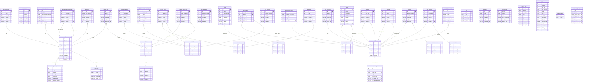

```mermaid
erDiagram

  "answer_log" {
    Int id "🗝️"
    Boolean is_corrected "❓"
    DateTime created_at 
    DateTime updated_at 
    DateTime deleted_at "❓"
    Int quiz_id 
    }
  

  "avg_lines_log" {
    Int id "🗝️"
    Decimal avg_line 
    Int total_lines 
    Int total_files 
    DateTime created_at 
    DateTime updated_at 
    DateTime deleted_at "❓"
    }
  

  "category" {
    Int id "🗝️"
    String name 
    Int file_num 
    DateTime created_at 
    DateTime updated_at 
    DateTime deleted_at "❓"
    }
  

  "category_parent_child" {
    Int id "🗝️"
    Int parent_category_id 
    Int child_category_id 
    DateTime created_at 
    DateTime updated_at 
    DateTime deleted_at "❓"
    }
  

  "category_quiz" {
    Int id "🗝️"
    Int quiz_id 
    Int category_id 
    DateTime created_at 
    DateTime updated_at 
    DateTime deleted_at "❓"
    }
  

  "englishbot_answer_log" {
    Int id "🗝️"
    Int word_id 
    Boolean result "❓"
    DateTime created_at 
    DateTime updated_at 
    DateTime deleted_at "❓"
    Int test_type 
    }
  

  "englishbot_example_answer_log" {
    Int id "🗝️"
    Int example_id 
    Boolean result "❓"
    DateTime created_at 
    DateTime updated_at 
    DateTime deleted_at "❓"
    Int test_type 
    }
  

  "example" {
    Int id "🗝️"
    String en_example_sentense 
    String ja_example_sentense 
    DateTime created_at 
    DateTime updated_at 
    DateTime deleted_at "❓"
    }
  

  "example_explanation" {
    Int id "🗝️"
    Int example_id 
    String explanation 
    DateTime created_at 
    DateTime updated_at 
    DateTime deleted_at "❓"
    }
  

  "example_source" {
    Int id "🗝️"
    Int example_id 
    Int source_id 
    DateTime created_at 
    DateTime updated_at 
    DateTime deleted_at "❓"
    }
  

  "mean" {
    Int id "🗝️"
    Int word_id 
    Int wordmean_id 
    Int partsofspeech_id 
    String meaning 
    DateTime created_at 
    DateTime updated_at 
    DateTime deleted_at "❓"
    }
  

  "partsofspeech" {
    Int id "🗝️"
    String name 
    DateTime created_at 
    DateTime updated_at 
    DateTime deleted_at "❓"
    }
  

  "quiz" {
    Int id "🗝️"
    Int file_num 
    Int quiz_num 
    String quiz_sentense 
    String answer 
    String img_file "❓"
    Boolean checked "❓"
    DateTime created_at 
    DateTime updated_at 
    DateTime deleted_at "❓"
    Int format_id 
    }
  

  "quiz_basis_advanced_linkage" {
    Int id "🗝️"
    Int basis_quiz_id 
    Int advanced_quiz_id 
    DateTime created_at 
    DateTime updated_at 
    DateTime deleted_at "❓"
    }
  

  "quiz_dependency" {
    Int id "🗝️"
    Int preliminary_quiz_id 
    Int quiz_id 
    DateTime created_at 
    DateTime updated_at 
    DateTime deleted_at "❓"
    }
  

  "quiz_dummy_choice" {
    Int id "🗝️"
    Int quiz_id 
    String dummy_choice_sentense 
    DateTime created_at 
    DateTime updated_at 
    DateTime deleted_at "❓"
    Boolean is_corrected 
    }
  

  "quiz_explanation" {
    Int id "🗝️"
    Int quiz_id 
    String explanation 
    DateTime created_at 
    DateTime updated_at 
    DateTime deleted_at "❓"
    }
  

  "quiz_file" {
    Int file_num "🗝️"
    String file_name 
    String file_nickname 
    DateTime created_at 
    DateTime updated_at 
    DateTime deleted_at "❓"
    }
  

  "quiz_format" {
    Int id "🗝️"
    String name 
    DateTime created_at 
    DateTime updated_at 
    DateTime deleted_at "❓"
    }
  

  "quiz_similarity" {
    Int id "🗝️"
    Int similarity_group_id 
    Int quiz_id 
    DateTime created_at 
    DateTime updated_at 
    DateTime deleted_at "❓"
    }
  

  "quiz_similarity_group" {
    Int id "🗝️"
    String similarity_group_name 
    DateTime created_at 
    DateTime updated_at 
    DateTime deleted_at "❓"
    }
  

  "saying" {
    Int id "🗝️"
    Int book_id 
    Int book_saying_id 
    String saying 
    String explanation 
    DateTime created_at 
    DateTime updated_at 
    DateTime deleted_at "❓"
    }
  

  "selfhelp_book" {
    Int id "🗝️"
    String name 
    DateTime created_at 
    DateTime updated_at 
    DateTime deleted_at "❓"
    }
  

  "source" {
    Int id "🗝️"
    String name 
    DateTime created_at 
    DateTime updated_at 
    DateTime deleted_at "❓"
    }
  

  "word" {
    Int id "🗝️"
    String name 
    String pronounce 
    DateTime created_at 
    DateTime updated_at 
    DateTime deleted_at "❓"
    Boolean checked 
    }
  

  "word_etymology" {
    Int id "🗝️"
    Int etymology_id 
    Int word_id 
    DateTime created_at 
    DateTime updated_at 
    DateTime deleted_at "❓"
    }
  

  "etymology" {
    Int id "🗝️"
    String name 
    DateTime created_at 
    DateTime updated_at 
    DateTime deleted_at "❓"
    }
  

  "word_example" {
    Int example_sentense_id "🗝️"
    Int word_id "🗝️"
    DateTime created_at 
    DateTime updated_at 
    DateTime deleted_at "❓"
    }
  

  "synonym" {
    Int id "🗝️"
    Int word_id 
    Int synonym_word_id 
    DateTime created_at 
    DateTime updated_at 
    DateTime deleted_at "❓"
    }
  

  "antonym" {
    Int id "🗝️"
    Int word_id 
    Int antonym_word_id 
    DateTime created_at 
    DateTime updated_at 
    DateTime deleted_at "❓"
    }
  

  "derivative" {
    Int id "🗝️"
    Int derivative_group_id 
    Int word_id 
    DateTime created_at 
    DateTime updated_at 
    DateTime deleted_at "❓"
    }
  

  "derivative_group" {
    Int id "🗝️"
    String derivative_group_name 
    DateTime created_at 
    DateTime updated_at 
    DateTime deleted_at "❓"
    }
  

  "word_source" {
    Int id "🗝️"
    Int word_id 
    Int source_id 
    DateTime created_at 
    DateTime updated_at 
    DateTime deleted_at "❓"
    }
  

  "word_subsource" {
    Int id "🗝️"
    Int word_id 
    String subsource 
    DateTime created_at 
    DateTime updated_at 
    DateTime deleted_at "❓"
    }
  

  "todo" {
    Int id "🗝️"
    String todo 
    DateTime created_at 
    DateTime updated_at 
    DateTime deleted_at "❓"
    }
  

  "todo_diary" {
    Int id "🗝️"
    String date 
    Boolean completed 
    DateTime created_at 
    DateTime updated_at 
    DateTime deleted_at "❓"
    }
  

  "category_view" {
    Int file_num 
    String category 
    BigInt count "❓"
    Decimal sum_of_clear_count "❓"
    Decimal sum_of_fail_count "❓"
    Decimal accuracy_rate "❓"
    }
  

  "quiz_file_view" {
    Int file_num 
    String file_name "❓"
    String file_nickname "❓"
    BigInt count "❓"
    Decimal clear "❓"
    Decimal fail "❓"
    Decimal not_answered "❓"
    Decimal accuracy_rate "❓"
    Decimal process_rate "❓"
    }
  

  "quiz_statistics_view" {
    Int id 
    BigInt clear_count "❓"
    BigInt fail_count "❓"
    BigInt answer_count "❓"
    BigInt accuracy_rate "❓"
    DateTime last_answer_log "❓"
    DateTime last_failed_answer_log "❓"
    }
  

  "quiz_view" {
    Int id 
    Int file_num "❓"
    Int quiz_num "❓"
    String quiz_sentense "❓"
    String answer "❓"
    String img_file "❓"
    Boolean checked "❓"
    BigInt clear_count "❓"
    BigInt fail_count "❓"
    Boolean not_answered "❓"
    DateTime created_at "❓"
    DateTime updated_at "❓"
    DateTime deleted_at "❓"
    BigInt accuracy_rate "❓"
    }
  

  "word_summarize" {
    String name 
    BigInt count 
    }
  

  "word_statistics_view" {
    Int id 
    String name "❓"
    BigInt clear_count "❓"
    BigInt fail_count "❓"
    BigInt accuracy_rate "❓"
    DateTime last_answer_log "❓"
    DateTime last_failed_answer_log "❓"
    }
  

  "source_statistics_view" {
    Int id 
    String name "❓"
    Decimal clear_count "❓"
    Decimal fail_count "❓"
    BigInt count "❓"
    BigInt not_answered "❓"
    Decimal accuracy_rate "❓"
    }
  
    "answer_log" }o--|| "quiz" : "quiz"
    "category" }o--|| "quiz_file" : "quiz_file"
    "category_parent_child" }o--|| "category" : "parent_category"
    "category_parent_child" }o--|| "category" : "child_category"
    "category_quiz" }o--|| "category" : "category"
    "category_quiz" }o--|| "quiz" : "quiz"
    "englishbot_answer_log" }o--|| "word" : "word"
    "englishbot_example_answer_log" }o--|| "example" : "example"
    "example_explanation" }o--|| "example" : "example"
    "example_source" }o--|| "example" : "example"
    "example_source" }o--|| "source" : "source"
    "mean" }o--|| "partsofspeech" : "partsofspeech"
    "mean" }o--|| "word" : "word"
    "quiz" }o--|| "quiz_format" : "quiz_format"
    "quiz" }o--|o "quiz_statistics_view" : "quiz_statistics_view"
    "quiz_basis_advanced_linkage" }o--|| "quiz" : "quiz_advanced_link"
    "quiz_basis_advanced_linkage" }o--|| "quiz" : "quiz_basis_link"
    "quiz_dummy_choice" }o--|| "quiz" : "quiz"
    "quiz_explanation" |o--|| "quiz" : "quiz"
    "saying" }o--|| "selfhelp_book" : "selfhelp_book"
    "word" }o--|o "word_statistics_view" : "word_statistics_view"
    "word_etymology" }o--|| "etymology" : "etymology"
    "word_etymology" }o--|| "word" : "word"
    "word_example" }o--|| "example" : "example"
    "word_example" }o--|| "word" : "word"
    "synonym" }o--|| "word" : "synonym_word"
    "synonym" }o--|| "word" : "synonym_original"
    "antonym" }o--|| "word" : "antonym_word"
    "antonym" }o--|| "word" : "antonym_original"
    "derivative" }o--|| "derivative_group" : "derivative_group"
    "derivative" |o--|| "word" : "word"
    "word_source" }o--|| "source" : "source"
    "word_source" }o--|| "word" : "word"
    "word_subsource" }o--|| "word" : "word"
```
